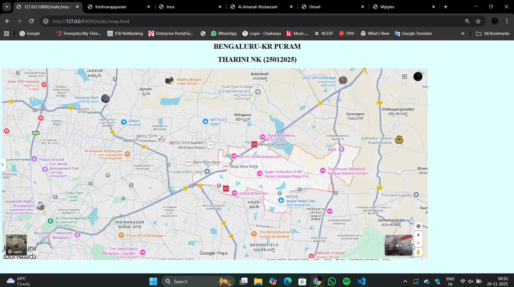
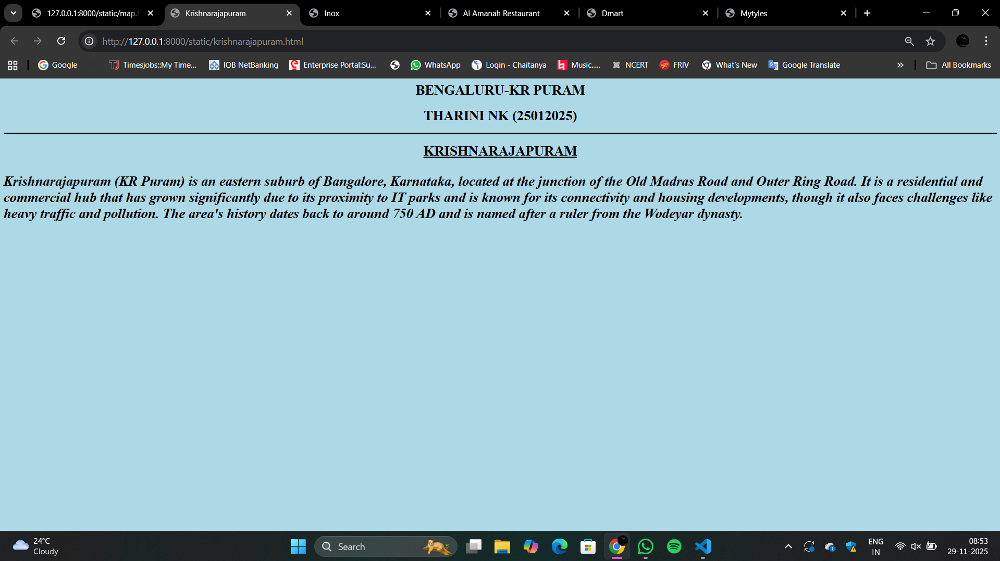
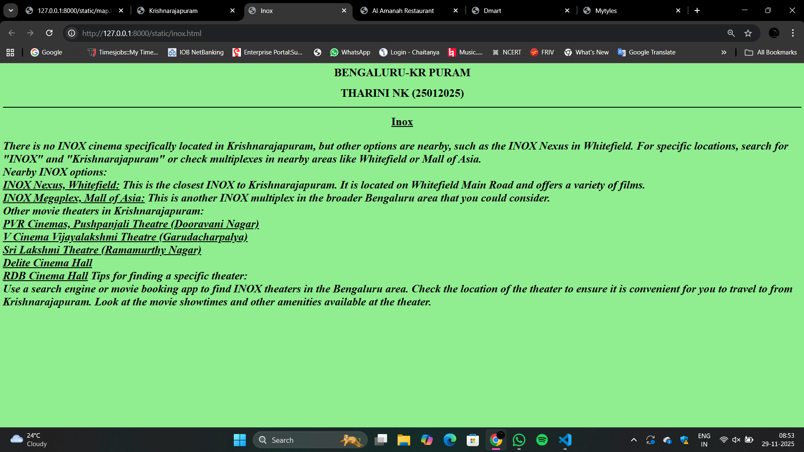
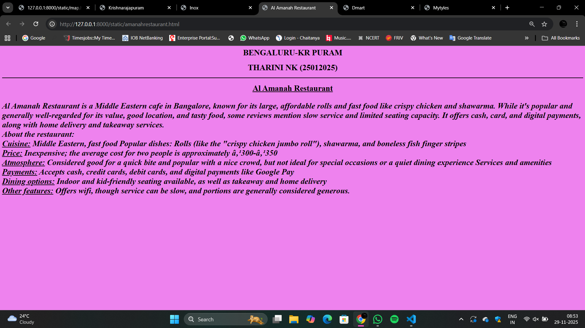
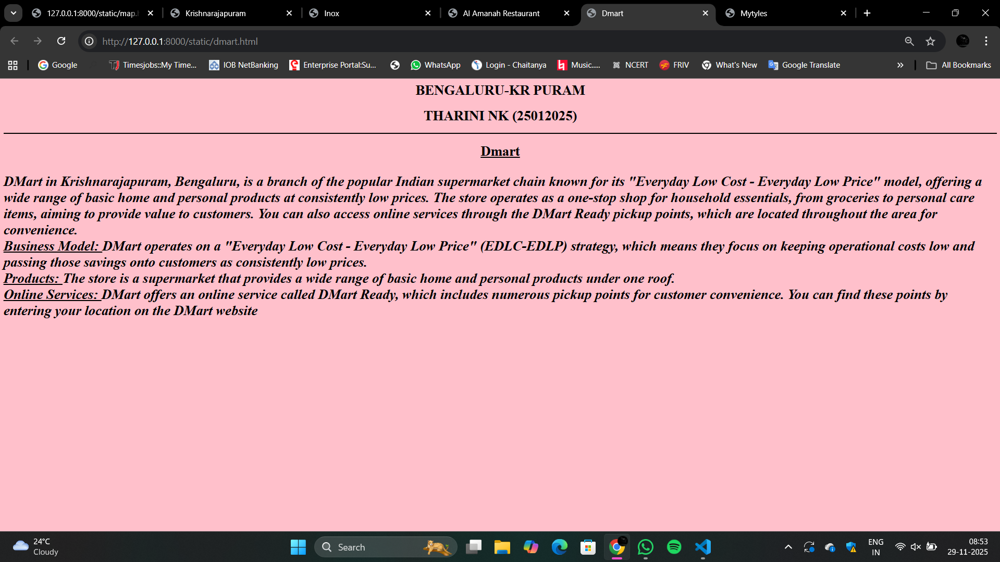
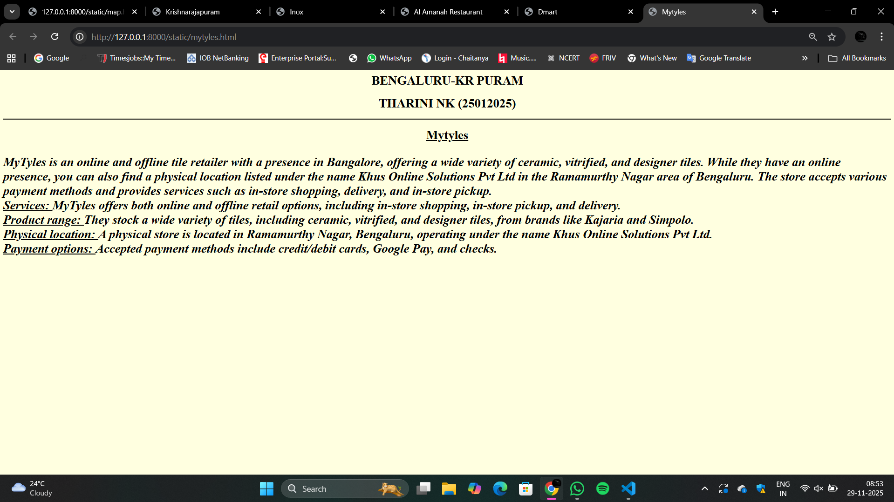

# Ex03 Places Around Me
## Date: 29-11-2025

## AIM
To develop a website to display details about the places around my house.

## DESIGN STEPS

### STEP 1
Create a Django admin interface.

### STEP 2
Download your city map from Google as an image.

### STEP 3
Insert the image using `````` tag and link it to the map.

### STEP 4
Using ```<map>``` tag name the map.

### STEP 5
Create clickable regions in the image using ```<area>``` tag.

### STEP 6
Write HTML programs for all the regions identified.

### STEP 7
Execute the programs and publish them.

## CODE
```
map.html

<html>
    <title></title>
    <head><h1 align="center">BENGALURU-KR PURAM</h1></head>
    <body bgcolor="lightcyan">
        <h1 align="center"> THARINI NK (25012025)</h1>
        

<map name="image-map">
    <area target="" alt="Krishnarajapuram" title="Krishnarajapuram" href="krishnarajapuram.html" coords="1025,370,1269,420" shape="rect">
    <area target="" alt="Inox" title="Inox" href="inox.html" coords="1503,354,56" shape="circle">
    <area target="" alt="Mytyles" title="Mytyles" href="mytyles.html" coords="872,222,899,280,1007,283,1032,221,985,179,921,182" shape="poly">
    <area target="" alt="Dmart" title="Dmart" href="dmart.html" coords="580,184,511,270,650,272" shape="poly">
    <area target="" alt="Al Amanah Restaurant" title="Al Amanah Restaurant" href="amanahrestaurant.html" coords="477,449,581,415,582,354,370,352,373,418" shape="poly">
</map>
    </body>
</html>

krishnarajapuram.html

<html>
    <title>Krishnarajapuram</title>
    <head><h1 align="center">BENGALURU-KR PURAM</h1></head>
    <body bgcolor="lightblue">
        <h1 align="center"> THARINI NK (25012025)</h1>
    <hr color="black">
    <head><h1 align="center"><u>KRISHNARAJAPURAM</u></h1></head>
    <h1><p><i>Krishnarajapuram (KR Puram) is an eastern suburb of Bangalore, Karnataka, located at the junction of the Old Madras Road and Outer Ring Road. It is a residential and commercial hub that has grown significantly due to its proximity to IT parks and is known for its connectivity and housing developments, though it also faces challenges like heavy traffic and pollution. The area's history dates back to around 750 AD and is named after a ruler from the Wodeyar dynasty.</i></p></h1>
    </body>
</html>

inox.html

<html>
    <title>Inox</title>
    <head><h1 align="center">BENGALURU-KR PURAM</h1></head>
    <body bgcolor="lightgreen">
        <h1 align="center"> THARINI NK (25012025)</h1>
    <hr color="black">
    <head><h1 align="center"><u>Inox</u></h1></head>
    <h1><p><i>There is no INOX cinema specifically located in Krishnarajapuram, but other options are nearby, such as the INOX Nexus in Whitefield. For specific locations, search for "INOX" and "Krishnarajapuram" or check multiplexes in nearby areas like Whitefield or Mall of Asia. 
<br>
Nearby INOX options:
<br>
<u>INOX Nexus, Whitefield:</u> This is the closest INOX to Krishnarajapuram. It is located on Whitefield Main Road and offers a variety of films.
<br>
<u>INOX Megaplex, Mall of Asia:</u> This is another INOX multiplex in the broader Bengaluru area that you could consider. 
<br>
Other movie theaters in Krishnarajapuram:
<br>
<u>PVR Cinemas, Pushpanjali Theatre (Dooravani Nagar)</u>
<br>
<u>V Cinema Vijayalakshmi Theatre (Garudacharpalya)</u>
<br>
<u>Sri Lakshmi Theatre (Ramamurthy Nagar)</u>
<br>
<u>Delite Cinema Hall</u>
<br>
<u>RDB Cinema Hall</u> 
Tips for finding a specific theater:
<br>
Use a search engine or movie booking app to find INOX theaters in the Bengaluru area.
Check the location of the theater to ensure it is convenient for you to travel to from Krishnarajapuram.
Look at the movie showtimes and other amenities available at the theater. </i></p></h1>
    </body>
</html>    

amanahrestaurant.html

<html>
    <title>Al Amanah Restaurant</title>
    <head><h1 align="center">BENGALURU-KR PURAM</h1></head>
    <body bgcolor="violet">
        <h1 align="center"> THARINI NK (25012025)</h1>
    <hr color="black">
    <head><h1 align="center"><u>Al Amanah Restaurant</u></h1></head>
    <h1><p><i>Al Amanah Restaurant is a Middle Eastern cafe in Bangalore, known for its large, affordable rolls and fast food like crispy chicken and shawarma. While it's popular and generally well-regarded for its value, good location, and tasty food, some reviews mention slow service and limited seating capacity. It offers cash, card, and digital payments, along with home delivery and takeaway services. 
<br>
<b></b>About the restaurant:</b>
<br>
<b><u>Cuisine:</b></u> Middle Eastern, fast food
Popular dishes: Rolls (like the "crispy chicken jumbo roll"), shawarma, and boneless fish finger stripes
<br>
<b><u>Price:</b></u> Inexpensive; the average cost for two people is approximately ₹300-₹350
<br>
<b><u>Atmosphere:</b></u> Considered good for a quick bite and popular with a nice crowd, but not ideal for special occasions or a quiet dining experience 
Services and amenities
<br>
<b><u>Payments:</b></u> Accepts cash, credit cards, debit cards, and digital payments like Google Pay
<br>
<b><u>Dining options:</b></u> Indoor and kid-friendly seating available, as well as takeaway and home delivery
<br>
<b><u>Other features:</b></u> Offers wifi, though service can be slow, and portions are generally considered generous.</i></p></h1>
    </body>
</html>  

dmart.html

<html>
    <title>Dmart</title>
    <head><h1 align="center">BENGALURU-KR PURAM</h1></head>
    <body bgcolor="pink">
        <h1 align="center"> THARINI NK (25012025)</h1>
    <hr color="black">
    <head><h1 align="center"><u>Dmart</u></h1></head>
    <h1><p><i>DMart in Krishnarajapuram, Bengaluru, is a branch of the popular Indian supermarket chain known for its "Everyday Low Cost - Everyday Low Price" model, offering a wide range of basic home and personal products at consistently low prices. The store operates as a one-stop shop for household essentials, from groceries to personal care items, aiming to provide value to customers. You can also access online services through the DMart Ready pickup points, which are located throughout the area for convenience. 
<br>
<b><u>Business Model: </u></b>DMart operates on a "Everyday Low Cost - Everyday Low Price" (EDLC-EDLP) strategy, which means they focus on keeping operational costs low and passing those savings onto customers as consistently low prices.
<br>
<b><u>Products: </u></b>The store is a supermarket that provides a wide range of basic home and personal products under one roof.
<br>
<b><u>Online Services: </u></b>DMart offers an online service called DMart Ready, which includes numerous pickup points for customer convenience. You can find these points by entering your location on the DMart website</i></p></h1>
    </body>
</html>    

mytyles.html

<html>
    <title>Mytyles</title>
    <head><h1 align="center">BENGALURU-KR PURAM</h1></head>
    <body bgcolor="lightyellow">
        <h1 align="center"> THARINI NK (25012025)</h1>
    <hr color="black">
    <head><h1 align="center"><u>Mytyles</u></h1></head>
    <h1><p><i>MyTyles is an online and offline tile retailer with a presence in Bangalore, offering a wide variety of ceramic, vitrified, and designer tiles. While they have an online presence, you can also find a physical location listed under the name Khus Online Solutions Pvt Ltd in the Ramamurthy Nagar area of Bengaluru. The store accepts various payment methods and provides services such as in-store shopping, delivery, and in-store pickup. 
<br>
<b><u>Services: </u></b>MyTyles offers both online and offline retail options, including in-store shopping, in-store pickup, and delivery.
<br>
<b><u>Product range: </u></b>They stock a wide variety of tiles, including ceramic, vitrified, and designer tiles, from brands like Kajaria and Simpolo.
<br>
<b><u>Physical location: </u></b>A physical store is located in Ramamurthy Nagar, Bengaluru, operating under the name Khus Online Solutions Pvt Ltd.
<br>
<b><u>Payment options: </u></b>Accepted payment methods include credit/debit cards, Google Pay, and checks.</i></p></h1>
    </body>
</html> 

```

## OUTPUT













## RESULT
The program for implementing image maps using HTML is executed successfully.
